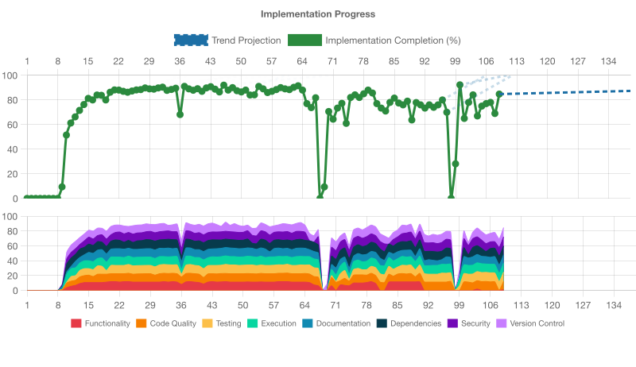

# Implementation Progress Assessment

**Generated:** 2025-11-07T00:21:53.063Z

Projected completion (from current rate): cycle 28.9

## IMPLEMENTATION STATUS: INCOMPLETE (66.25% ± 8% COMPLETE)

## OVERALL ASSESSMENT
While the CLI runs and tests pass for basic flags, most core features are missing. Functionality, testing, code quality, documentation, dependencies, and security all fall below required thresholds; significant improvements are needed in these areas before completion.

## NEXT PRIORITY
Implement version age fetching and calculation to add core age-display functionality.

## FUNCTIONALITY ASSESSMENT (55% ± 14% COMPLETE)
- Basic CLI functionality is present (help flag, outdated check) but core advertised features (age calculation) are missing and there is no coverage for actual output formatting or logic beyond help.
- bin/dry-aged-deps.js implements a CLI entry point and responds to --help correctly (exit code 0).
- Running the tool with no outdated dependencies prints “All dependencies are up to date.” as expected.
- No tests cover the main functionality of parsing npm outdated JSON and printing a table of outdated packages.
- The README advertises age calculations (“display how long they have been outdated”) but the implementation only prints name and version columns.
- Error handling exists for JSON parse failures, but there is no coverage or validation of real npm outdated data.

**Next Steps:**
- Implement the logic to calculate and display how long each dependency has been outdated (e.g., using npm registry metadata).
- Add unit tests and/or CLI integration tests for scenarios with actual outdated dependencies/JSON fixtures.
- Enhance output formatting and consider adding flags to control columns or filtering.
- Update documentation to align with implemented features or expand implementation to cover advertised behavior.

## CODE_QUALITY ASSESSMENT (55% ± 15% COMPLETE)
- The project provides a working CLI implementation with basic error handling and a minimal test suite, but lacks linting/formatting configuration, broader test coverage, and more structured code organization.
- No linting or formatting configuration found (no .eslintrc, Prettier, or related scripts).
- package.json has no lint or format scripts to enforce code style.
- Single-source CLI code in bin/dry-aged-deps.js; no src directory for separation of concerns.
- Only one test covers the --help flag; core functionality (parsing npm outdated data) is untested.
- No CI checks for linting or formatting; only tests are configured via Vitest.
- Code uses CommonJS require/imports without type checking or modern module structure.

**Next Steps:**
- Add ESLint (and optionally Prettier) configuration and npm scripts to enforce code style.
- Expand test coverage to include parsing logic, edge cases, and error branches.
- Refactor code into a src directory and split functionality into smaller modules.
- Integrate linting and tests into CI pipeline to catch issues early.
- Consider adopting TypeScript or JSDoc for stronger typing guarantees.

## TESTING ASSESSMENT (50% ± 17% COMPLETE)
- The project has a basic Vitest setup with a single CLI unit test that passes, but lacks broader test coverage, integration/e2e tests, coverage reporting, and CI integration.
- Vitest is configured (vitest.config.js) and invoked via npm test
- Only one test file found (test/cli.test.js) containing a single help‐flag test
- Coverage run fails due to missing '@vitest/coverage-v8' dependency
- No test coverage reports, thresholds, or badges present
- No integration or end-to-end tests detected
- No CI workflows (e.g., GitHub Actions) are configured

**Next Steps:**
- Add and configure a coverage plugin (e.g., @vitest/coverage-v8) and enforce coverage thresholds
- Expand unit tests to cover core functionality and edge cases
- Introduce integration and end-to-end tests where appropriate
- Set up continuous integration (e.g., GitHub Actions) to run tests on each commit/pull request

## EXECUTION ASSESSMENT (85% ± 8% COMPLETE)
- The CLI installs, tests, and runs cleanly with robust error handling, but execution testing is limited to the help flag and no integration tests cover actual outdated-output scenarios.
- npm install completes with no errors or vulnerabilities
- Vitest test suite passes (1 test for --help behavior)
- CLI launches via `npm start` and prints expected output (‘All dependencies are up to date.’)
- Error handling around `npm outdated` exit codes and JSON parsing is implemented
- No build step needed for this Node CLI and no runtime warnings/errors observed

**Next Steps:**
- Add integration tests that simulate `npm outdated` returning data to verify output formatting
- Expand tests to cover error paths (e.g., malformed JSON, missing npm binary)
- Integrate a CI pipeline to run install, tests, and smoke-run on pull requests
- Validate cross‐platform execution (Windows, Linux, macOS) in CI

## DOCUMENTATION ASSESSMENT (70% ± 12% COMPLETE)
- Project has solid basic documentation (README, CHANGELOG, contribution guidelines, internal user‐story docs) but lacks deeper architectural/usage details, complete changelog entries, and comprehensive code documentation.
- README.md provides installation, usage, and contribution guidelines but minimal examples or flag documentation
- CHANGELOG.md exists but only contains a version header with no release details
- docs/ contains user‐story maps (planning) but no formal architecture or design documentation
- Code includes minimal JSDoc (printOutdated) and comments, but no docstrings for core logic
- No API or extended CLI reference beyond basic help output

**Next Steps:**
- Populate CHANGELOG.md with actual release notes for each version
- Enhance README with detailed usage examples, flag descriptions, and output samples
- Add formal architecture or design docs in docs/ (e.g., flow diagrams, module overviews)
- Augment code with JSDoc/docstrings for key functions and modules
- Provide a developer guide covering setup, testing, and contribution workflows in docs/ or in README

## DEPENDENCIES ASSESSMENT (75% ± 14% COMPLETE)
- Dependencies are correctly declared with zero vulnerabilities and no outdated packages, but the absence of a lockfile hampers reproducible installs.
- package.json defines only devDependencies (execa, vitest) and no runtime dependencies, matching the minimal CLI implementation
- npm audit reported 0 vulnerabilities across all installed packages
- npm outdated returned an empty result, indicating no out-of-date packages
- No lockfile (package-lock.json or yarn.lock) is committed, which undermines reproducible dependency installation

**Next Steps:**
- Commit a lockfile (package-lock.json or yarn.lock) to ensure consistent installs across environments
- Add a CI step to run `npm audit` and `npm outdated` to catch future vulnerabilities and outdated packages automatically
- If adding runtime dependencies in the future, ensure they are declared under "dependencies" in package.json and reviewed for security

## SECURITY ASSESSMENT (60% ± 12% COMPLETE)
- The project is a simple CLI with no direct vulnerabilities found, but it lacks security automation, CI/CD workflows, and broader security controls.
- npm audit reports zero vulnerabilities
- No GitHub Actions or other CI/CD workflows for security checks found
- No evidence of secret scanning or handling (no .env usage or secret detection)
- Minimal input handling (only help flag) with no broader validation
- No automated security testing (e.g., SAST, dependency checks in CI)

**Next Steps:**
- Add a CI/CD pipeline (e.g., GitHub Actions) to run npm audit, linting, and tests on pull requests
- Implement automated secret scanning (e.g., GitHub secret scanning or tools like truffleHog)
- Introduce SAST or code-analysis tools to catch potential security issues early
- Expand input validation and error handling to guard against edge cases
- Consider integrating dependency-update automation (e.g., Dependabot) to keep dependencies up-to-date

## VERSION_CONTROL ASSESSMENT (80% ± 17% COMPLETE)
- Well-maintained Git history with clear, conventional commit messages and a comprehensive .gitignore, but missing lock file, release tags, and minor uncommitted changes exist.
- Conventional commit messages in git log (feat, chore, docs, test)
- Comprehensive .gitignore present covering dependencies, build outputs, and editor files
- Clean working directory aside from two modified .voder metadata files
- No lock file (package-lock.json or yarn.lock) tracked for deterministic installs
- No Git tags or release versioning found

**Next Steps:**
- Commit and track a lock file (package-lock.json or yarn.lock) to ensure reproducible builds
- Use Git tags for each release to enable easy versioning and rollbacks
- Review and commit or clean up .voder files to maintain a fully clean working directory
- Consider adding a branching strategy (e.g., develop, feature branches) for larger-scale development
- Optionally implement commit signing or enforce commit message validation via CI
